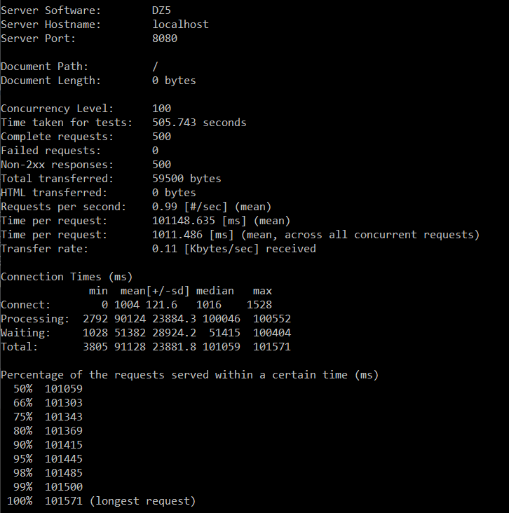
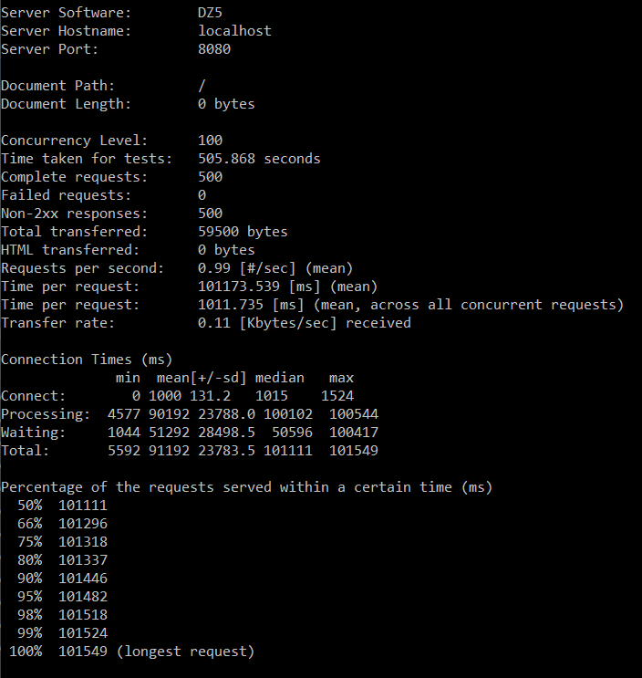

## Архитектура
Используется thread pool
## запуск сервера 
```
python httpd.py -r [path_to_data_dir]  -w [workers_count] -p [port]
```
## запуск тестов
```
python tests.py
```
## результаты нагрузочного тестирование
Параметры запуска
```
ab -n 500 -c 100 -r http://localhost:8080/
```
Для 2 воркеров

Для 4 воркеров

